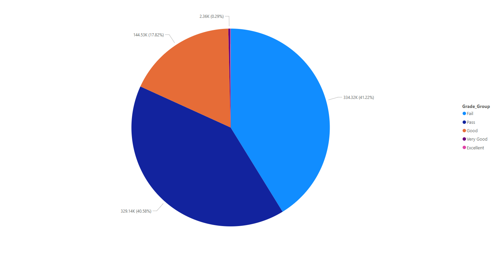

# Egyptian Student Grades Analysis

A data analysis project exploring the distribution of grades across a large dataset of Egyptian students.

## Project Overview

This project analyzes a dataset of student grades using Excel, Python, SQL, and Power BI. The goal was to practice data cleaning, analysis, and visualization skills.

## What I Did

- **Data Cleaning & Exploration**: Handled the dataset using Excel and Python (Pandas) to check for inconsistencies and understand the data structure.
- **Analysis with Python & SQL**: Performed statistical analysis and categorized grades into performance groups.
- **Visualization with Power BI**: Created simple and effective visualizations to communicate the findings.

## Key Findings

- The average grade was **201.963**
- The distribution of grades across categories was as follows:
  - Failed (under 205): 334,321 students
  - Passed (above 205): 329,136 students
  - Good (above 266.5): 144,526 students
  - Very Good (above 328): 2,359 students
  - Excelent (above 369): 640 students

## Visualizations

### Grade Distribution

### Performance Breakdown

## Tools Used

- Microsoft Excel
- Python (Pandas, Seaborn, Matplotlib)
- SQL (Microsoft Access)
- Power BI

## How to Use This Repository

The main files in this repository are:
- `student_grades_analysis.ipynb`: The Jupyter Notebook containing all the Python code.
- `egypt_students_cleaned.xlsx`: The cleaned and anonymized dataset.
- `Dashboard.pbix`: The Dashboard
- The SQL queries used
- `README.md`: This file.